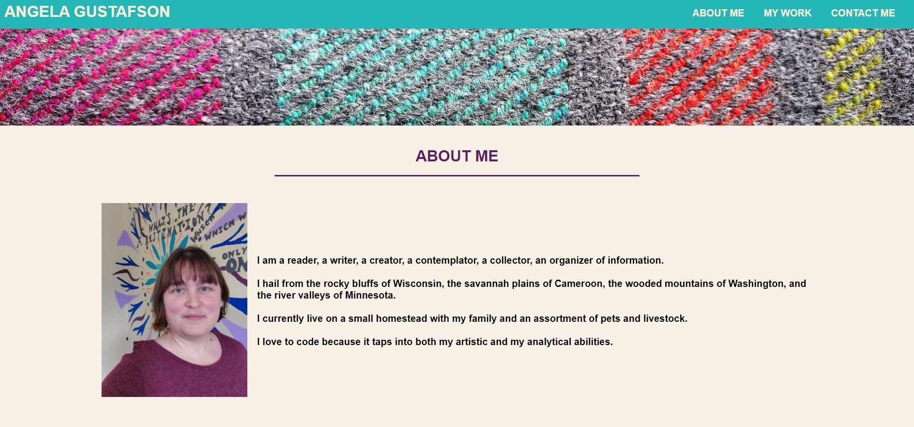

# Angela Gustafson Portfolio

## Description

A website that presents information about myself,Angela Gustafson, including links to my coding projects and my contact information.  

## Built With

-  HTML
-  CSS

## Website

https://angiebunk1.github.io/Portfolio/

## Usage

The primary intended user is a potential employer who would like to see samples of my work. 
When they navigate to the page they will be presented with my image and a short bio, followed by links to a sampling of my work and a list of ways to contact me.  When they click on screenshots of my projects the links will open new tabs with the rendered websites of the projects.  When they click on the link to my github profile they will see the readme files and other information about my projects.  

## Contribution

Created by Angela Gustafson